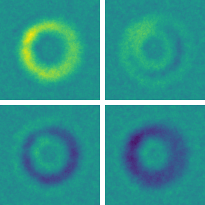

# gridtoy
 Toy simulator for simple network dynamics with grid topology

## Dependencies
- [NumPy](https://numpy.org/)
- [SciPy](https://www.scipy.org/)
- [Matplotlib](https://matplotlib.org/)
- [PyQtGraph](http://www.pyqtgraph.org/)
- [ModernGL](https://moderngl.readthedocs.io/en/latest/) - Needed only for the bonus [diffusion_moderngl.py](diffusion_moderngl.py)
- [Pillow (PIL)](https://pillow.readthedocs.io/en/stable/) - Needed for image export
- [ffmpeg](https://ffmpeg.org/)- Needed for video compilation
    

## Basics
This package simulates some basic dynamics on a network with grid topology, which admits simple and computationally efficient state updates since only 4 (or 8 in the Game of Life) immediate neighbors need to inspected for the state update. In particular, mass-spring-damper and diffusion dynamics are implemented.

## Walkthrough
### diffusion_simple
Take a look through [diffusion_simple.py](diffusion_simple.py) or [diffusion_simple.ipynb](diffusion_simple.ipynb) to get a basic idea of the simulation. These run basic diffusion dynamics and use [Matplotlib](https://matplotlib.org/) for visualization. Note that although the simulation in diffusion_simple runs faster than in main (below), Matplotlib runs slower than PyQtGraph so the visualization in diffusion_simple will be slower.

### main
Run [main.py](main.py) with any of the demo settings to try out the full code. You can view the position and velocity states, position and velocity noises, and external force simultaneously. Extra processing such as mean-centering, upscaling using cubic interpolation, and image histograms with interactive thresholds are made available. Additionally, you may specify an output directory to save each frame of each image. A demo video is available in [simulation.mp4](simulation.mp4).

### simulation
The functions and classes in [simulation.py](simulation.py) are used to simulate the system with combined mass-spring-damper and diffusion dynamics using forward Euler (1st order) or Runge-Kutta 4th order ODE integration. Settings are provided to obtain diffusion only and mass-spring-damper only dynamics as special cases. Note however that the simplifications to the code in these special cases are not implmeneted explicitly, so the code will not run any faster e.g. as fast as the simulation in diffusion_simple. 

### display
The functions and classes in [display.py](display.py) are used for visualization using [PyQtGraph](http://www.pyqtgraph.org/), which gives much faster realtime performance compared to Matplotlib.

### videowriter
Run this script to compile saved image frames into an .mp4 video using [ffmpeg](https://ffmpeg.org/).

## Bonus stuff
- [diffusion_golf.py](diffusion_golf.py) implements diffusion dynamics and visualization in as few keystrokes and lines as possible using only NumPy, SciPy, and Matplotlib
- [diffusion_moderngl.py](diffusion_moderngl.py) implements diffusion dynamics using ModernGL, which is a high performance rendering module for Python. The simulation is implemented as a shader that runs on the GPU. This code runs orders of magnitude faster than the main code, but is considerably harder to work with for non-OpenGL users.
- [life.py](life.py) implements Conway's Game of Life
